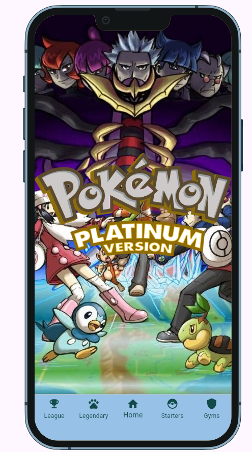
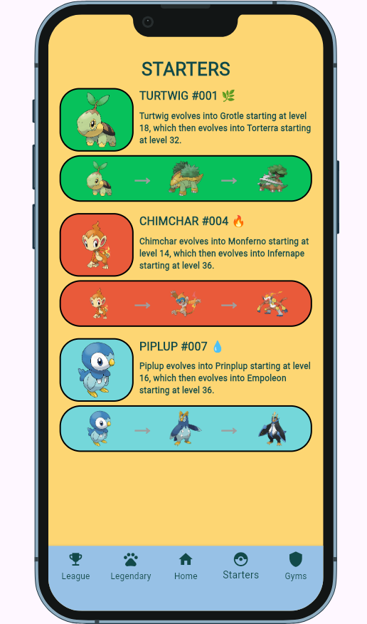
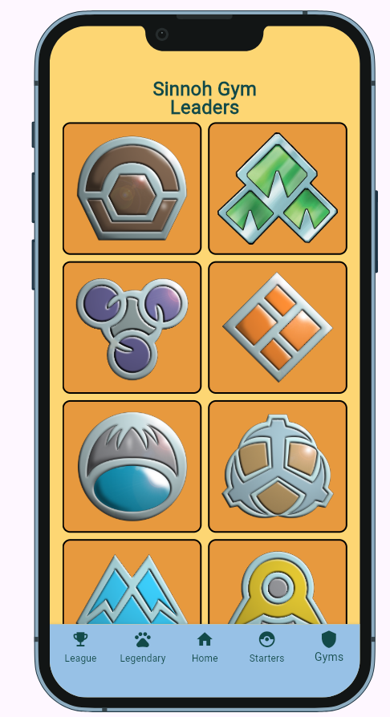
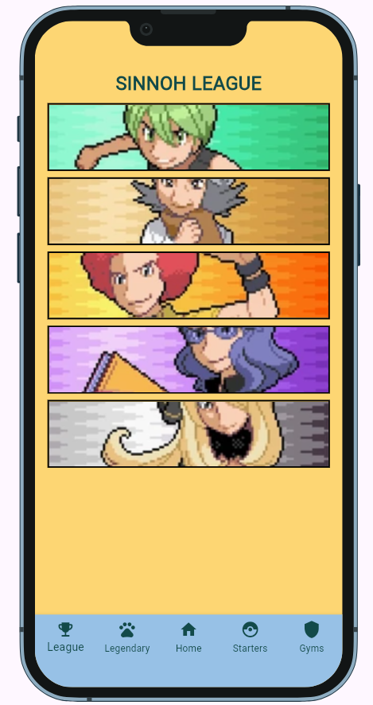
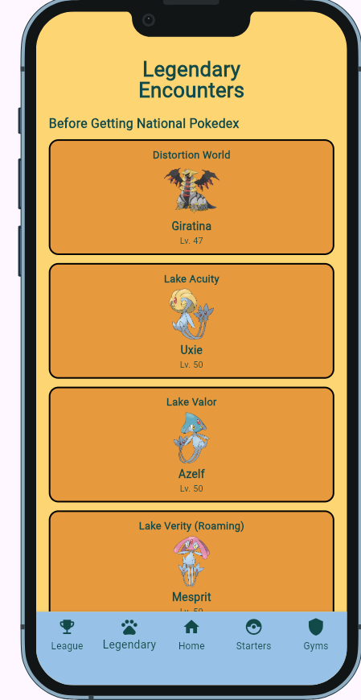
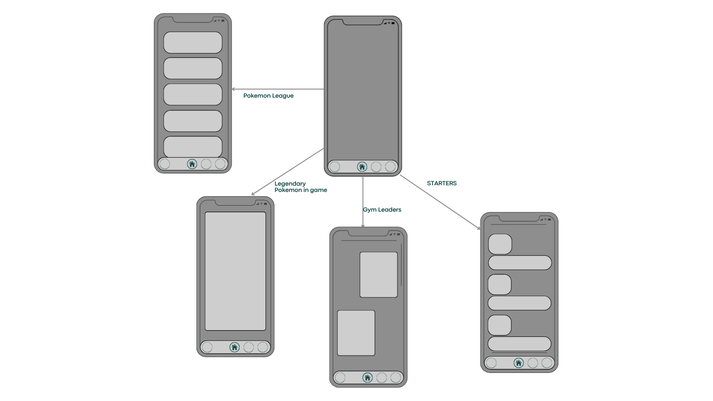

## Mockup

## Home

## Starter

## Gym

## League

## Legendary

## Wireframes

Your earlier box-and-label sketches and the screen flow: which screen opens
first, and how a user moves between them. Photos of paper are fine.

## Screens

1. Home Page
What the user does here:
The user chooses which part of the Pokémon Platinum guide they want to view.
Tappable elements and destinations:
● Starter icon → Starter Screen
● Gym Leaders icon → Sinnoh Gym Leaders
● Pokémon League icon → Pokémon League
● Legendary Pokémon icon → Legendary Encounters
● Home icon → Returns to the Home Page

2. Starter Screen
What the user does here:
The user views information about the three Sinnoh starter Pokémon: Turtwig, Chimchar, and
Piplup.
Tappable elements and destinations:
● Bottom navigation buttons → Open the corresponding guide section.
● There are no tappable elements on the starter information itself.

3. Sinnoh Gym Leaders
What the user does here:
The user selects a Gym Leader badge to view information about that Gym Leader's team.
Tappable elements and destinations:
● Each Gym badge → Shows the selected Gym Leader's team
● Navigation icons → Open the corresponding guide section
● Home icon → Returns to the Home Page

4. Pokémon League
What the user does here:
The user selects a Pokémon League member to view their Pokémon team.
Tappable elements and destinations:
● Each member banner → Shows that member's Pokémon team
● Navigation icons → Open the corresponding guide section
● Home icon → Returns to the Home Page

5. Legendary Encounters
What the user does here:
The user views Legendary Pokémon available in Pokémon Platinum and where they can be
encountered.
Tappable elements and destinations:
● Legendary Pokémon section → Shows information about the selected Legendary
Pokémon and its encounter location
● Navigation icons → Open the corresponding guide section
● Home icon → Returns to the Home Page
